# Architecture & Design Document

## Budget Lens Personal Finance Platform

**Version:** 1.0  
**Date:** September 2025  
**Status:** Current

---

## Table of Contents

1. [Architecture Overview](#1-architecture-overview)
2. [Domain Model & Data Design](#2-domain-model--data-design)
3. [GraphQL API Design](#3-graphql-api-design)
4. [Implementation Patterns](#4-implementation-patterns)
5. [Federation & Migration Strategy](#5-federation--migration-strategy)
6. [Appendices](#6-appendices)

---

## 1. Architecture Overview

### 1.1 System Architecture Principles

Budget Lens follows a **Hexagonal Architecture** (Ports & Adapters) combined with **Modular Monolith** principles, designed for eventual migration to **GraphQL Federation** as the system scales.

#### Core Architectural Decisions

- **Hexagonal Architecture**: Business logic isolation with clear port/adapter boundaries
- **Event Sourcing**: Complete audit trail through immutable event store
- **CQRS**: Separate read/write models for optimal performance
- **GraphQL-First API**: Flexible, type-safe API with real-time subscriptions
- **Modular Monolith**: Clear module boundaries preparing for eventual service extraction

### 1.2 Technology Stack

#### Backend Technologies

- **Runtime**: .NET 10 (preview) with C# preview features
- **API Framework**: GraphQL using HotChocolate 15.x
- **Database**: PostgreSQL with Event Sourcing pattern
- **Caching**: Redis for performance optimization
- **ML Framework**: ML.NET for categorization and predictions
- **Messaging**: MediatR for in-process CQRS commands/queries
- **Orchestration**: .NET Aspire for service management

#### Key Libraries & Frameworks

```csharp
// Core GraphQL
HotChocolate 15.x
HotChocolate.AspNetCore
HotChocolate.Subscriptions

// Database & Persistence
Npgsql.EntityFrameworkCore.PostgreSQL
Microsoft.EntityFrameworkCore

// CQRS & Messaging
MediatR
FluentValidation

// ML & Analytics
Microsoft.ML
Microsoft.ML.AutoML

// Caching & Performance
StackExchange.Redis
Microsoft.Extensions.Caching.Memory
```

### 1.3 System Architecture Diagram

```
┌─────────────────────────────────────────────────────────────────────┐
│                        CLIENT APPLICATIONS                          │
│     Web App (React)    │    Mobile Apps    │    Third-party APIs   │
└─────────────────┬───────────────────┬─────────────────────┬─────────┘
                  │                   │                     │
┌─────────────────▼───────────────────▼─────────────────────▼─────────┐
│                     GRAPHQL API GATEWAY                             │
│          HotChocolate Server with Subscriptions                     │
└─────────────────┬───────────────────────────────────────────────────┘
                  │
┌─────────────────▼─────────────────────────────────────────────────────┐
│                    APPLICATION LAYER (CQRS)                          │
│  ┌─────────────┐ ┌─────────────┐ ┌─────────────┐ ┌─────────────┐    │
│  │   Accounts  │ │ Transactions│ │   Budgets   │ │Intelligence │    │
│  │   Module    │ │   Module    │ │   Module    │ │   Module    │    │
│  └─────────────┘ └─────────────┘ └─────────────┘ └─────────────┘    │
│  ┌─────────────┐ ┌─────────────┐ ┌─────────────┐ ┌─────────────┐    │
│  │ Households  │ │    Debts    │ │    Bills    │ │  Analytics  │    │
│  │   Module    │ │   Module    │ │   Module    │ │   Module    │    │
│  └─────────────┘ └─────────────┘ └─────────────┘ └─────────────┘    │
└─────────────────┬─────────────────────────────────────────────────────┘
                  │
┌─────────────────▼─────────────────────────────────────────────────────┐
│                      DOMAIN LAYER (CORE)                             │
│  Account    Transaction    Budget    Household    Debt    Category    │
│  Aggregates with Domain Events, Value Objects, Domain Services       │
└─────────────────┬─────────────────────────────────────────────────────┘
                  │
┌─────────────────▼─────────────────────────────────────────────────────┐
│                  INFRASTRUCTURE LAYER                                │
│  ┌──────────────┐ ┌──────────────┐ ┌──────────────┐ ┌──────────────┐ │
│  │  PostgreSQL  │ │    Redis     │ │   ML.NET     │ │  External    │ │
│  │ Event Store  │ │   Caching    │ │   Models     │ │   APIs       │ │
│  └──────────────┘ └──────────────┘ └──────────────┘ └──────────────┘ │
└───────────────────────────────────────────────────────────────────────┘
```

### 1.4 Module Structure

The system is organized into **8 core modules**, each with clear boundaries and responsibilities:

#### Core Financial Modules

1. **Accounts Module** - Account management, balances, reconciliation
2. **Transactions Module** - Transaction processing, categorization, audit trail
3. **Budgets Module** - 7 budget strategies, performance tracking
4. **Categories Module** - Hierarchical categorization, ML training data

#### Advanced Feature Modules

5. **Intelligence Module** - ML predictions, anomaly detection, insights
6. **Households Module** - Family management, permissions, shared resources
7. **Debts Module** - Debt tracking, payoff strategies, projections
8. **Bills Module** - Recurring bill tracking, reminders, payments

### 1.5 Performance Requirements

- **API Response Time**: <200ms for 95th percentile queries
- **ML Prediction Time**: <100ms for transaction categorization
- **Event Store Queries**: Sub-second historical data retrieval
- **Real-time Updates**: GraphQL subscriptions for live transaction processing
- **Throughput**: Support for 10,000+ concurrent users
- **Database Performance**: Materialized views for complex aggregations

### 1.6 Security Architecture

#### Authentication & Authorization

- **Authentication**: OAuth 2.0/OpenID Connect integration
- **Authorization**: Role-based access control with household permissions
- **Multi-tenancy**: Household-based data isolation using Row-Level Security

#### Data Protection

- **Encryption**: AES-256 at rest, TLS 1.3 in transit
- **Audit Logging**: All financial data access tracked in event store
- **PCI Compliance**: Secure handling of financial data without storing card numbers
- **Data Privacy**: GDPR/CCPA compliant with data retention policies

#### Security Implementation

```csharp
// Row-Level Security Example
[PolicyName("household_policy")]
public class HouseholdSecurityPolicy : ISecurityPolicy
{
    public string PolicyDefinition => 
        "user_id = current_user_id() OR household_id IN (SELECT household_id FROM household_members WHERE user_id = current_user_id())";
}

// GraphQL Authorization
[Authorize(Policy = "HouseholdMember")]
[UseFiltering]
[UseSorting]
public async Task<IQueryable<Transaction>> GetTransactionsAsync(
    [Service] IBudgetContext context,
    ClaimsPrincipal claimsPrincipal)
{
    var userId = claimsPrincipal.GetUserId();
    return context.Transactions.Where(t => t.IsAccessibleBy(userId));
}
```

---

## 2. Domain Model & Data Design

### 2.1 Domain-Driven Design Overview

Budget Lens uses **Domain-Driven Design** principles with **Event Sourcing** to capture the complete financial history and enable advanced features like audit trails and temporal queries.

#### Core Domain Concepts

**Aggregates**: Self-contained units of business logic with clear boundaries

- Account Aggregate (transactions, balances, reconciliation)
- Budget Aggregate (multiple strategies, performance tracking)
- Household Aggregate (members, permissions, shared resources)
- Debt Aggregate (payoff plans, projections)

**Domain Events**: Capture all state changes for event sourcing

```csharp
public abstract record DomainEvent(
    Guid EventId,
    DateTime OccurredAt,
    Guid UserId,
    string EventType,
    int Version
);

// Example domain events
public record TransactionCreatedEvent(
    Guid EventId, DateTime OccurredAt, Guid UserId, string EventType, int Version,
    Guid TransactionId, Guid AccountId, decimal Amount, string Description
) : DomainEvent(EventId, OccurredAt, UserId, EventType, Version);

public record BudgetExceededEvent(
    Guid EventId, DateTime OccurredAt, Guid UserId, string EventType, int Version,
    Guid BudgetId, Guid CategoryId, decimal BudgetLimit, decimal ActualSpent
) : DomainEvent(EventId, OccurredAt, UserId, EventType, Version);
```

### 2.2 Entity Relationship Diagram

The following ERD represents the complete domain model for Budget Lens, supporting multiple budget strategies, ML intelligence, and household management:

```mermaid
erDiagram
    User ||--o{ Account : owns
    User ||--o{ Category : creates
    User ||--o{ Budget : manages
    User ||--o{ Goal : sets
    User ||--o{ Tag : defines
    User ||--o{ Alert : configures
    User ||--o{ Report : generates
    User ||--o{ ScheduledTransaction : schedules
    User ||--o{ Bill : tracks
    User ||--o{ DebtPayoffPlan : creates
    User ||--o{ MLPreference : configures
    User }o--o{ Household : "belongs to"
    
    Household ||--o{ HouseholdMember : contains
    Household ||--o{ SharedAccount : shares
    Household ||--o{ SharedBudget : manages
    HouseholdMember }o--|| User : "is a"
    
    Account ||--o{ Transaction : contains
    Account ||--o{ Transfer : "source for"
    Account ||--o{ Transfer : "destination for"
    Account ||--o{ Goal : "funds towards"
    Account ||--o{ AccountEvent : "generates events"
    
    Transaction }o--|| Category : "belongs to"
    Transaction }o--|| Payee : "paid to"
    Transaction }o--o{ Tag : "tagged with"
    Transaction ||--o{ Attachment : "has receipts"
    Transaction }o--|| ScheduledTransaction : "created by"
    Transaction ||--o{ TransactionEvent : "generates events"
    Transaction ||--o{ MLPrediction : "has predictions"
    Transaction }o--o{ EnvelopeAllocation : "allocated to"
    
    Category ||--o{ Category : "parent of"
    Category ||--o{ CategoryBudget : "budgeted in"
    Category ||--o{ MLTrainingData : "used for training"
    Category ||--o{ ValueMapping : "maps to values"
    
    Budget ||--o{ BudgetPeriod : "has periods"
    Budget ||--o{ BudgetEvent : "generates events"
    
    EnvelopeBudget }|--|| Budget : extends
    TraditionalBudget }|--|| Budget : extends
    PercentageBudget }|--|| Budget : extends
    PriorityBudget }|--|| Budget : extends
    RollingBudget }|--|| Budget : extends
    ValueBasedBudget }|--|| Budget : extends
    HybridBudget }|--|| Budget : extends
    
    EnvelopeBudget ||--o{ Envelope : contains
    Envelope ||--o{ EnvelopeAllocation : tracks
    Envelope ||--o{ EnvelopeTransfer : "transfers between"
    
    TraditionalBudget ||--o{ CategoryBudget : defines
    CategoryBudget }o--|| Category : "limits spending for"
    
    PercentageBudget ||--o{ PercentageRule : defines
    PercentageRule }o--o{ Category : includes
    
    PriorityBudget ||--o{ BudgetPriority : defines
    BudgetPriority }o--o{ Category : "links to"
    BudgetPriority }o--|| Account : "auto-transfers to"
    
    ValueBasedBudget ||--o{ PersonalValue : defines
    PersonalValue ||--o{ ValueMapping : "maps categories"
    
    HybridBudget ||--o{ ComponentBudget : combines
    ComponentBudget }o--|| Budget : references
    
    BudgetPeriod }o--o{ Transaction : tracks
    BudgetPeriod ||--o{ BudgetPerformance : calculates
    
    Transfer }o--|| Transaction : "debit transaction"
    Transfer }o--|| Transaction : "credit transaction"
    
    ScheduledTransaction }o--|| Payee : "pays to"
    ScheduledTransaction }o--|| Category : "categorized as"
    ScheduledTransaction ||--o{ RecurrenceRule : "follows"
    
    Bill ||--|| ScheduledTransaction : extends
    Bill }o--|| Payee : "owed to"
    Bill ||--o{ BillPayment : "tracks payments"
    Bill ||--o{ BillReminder : generates
    
    Goal }o--|| Account : "linked to"
    
    DebtPayoffPlan ||--o{ Debt : contains
    DebtPayoffPlan ||--o{ PayoffProjection : generates
    Debt }o--|| Account : "tracks in"
    
    EventStore ||--o{ DomainEvent : stores
    AccountEvent }|--|| DomainEvent : "type of"
    TransactionEvent }|--|| DomainEvent : "type of"
    BudgetEvent }|--|| DomainEvent : "type of"
    UserEvent }|--|| DomainEvent : "type of"
    
    AuditLog ||--o{ AuditEntry : contains
    AuditEntry }o--|| User : "performed by"
    AuditEntry }o--|| DomainEvent : "references"
    
    MLModel ||--o{ MLPrediction : generates
    MLModel ||--o{ MLTrainingData : "trained on"
    
    MLPrediction }o--|| Transaction : "predicts for"
    MLPrediction }o--|| Category : "suggests"
    
    MLTrainingData }o--o{ Transaction : "uses"
    MLTrainingData }o--o{ Category : "labels"
    
    SpendingInsight ||--o{ InsightRecommendation : provides
    SpendingInsight }o--o{ Transaction : "based on"
    SpendingInsight }o--|| User : "generated for"
    
    SpendingAnomaly }o--|| Transaction : "detected in"
    SpendingAnomaly }o--|| MLModel : "detected by"
    
    CashFlowForecast }o--|| User : "generated for"
    CashFlowForecast ||--o{ ForecastPeriod : contains
    CashFlowForecast }o--|| MLModel : "generated by"
```



### 2.3 Core Entity Definitions

#### Primary Financial Entities

**User Entity**

```sql
CREATE TABLE users (
    id UUID PRIMARY KEY DEFAULT gen_random_uuid(),
    email VARCHAR(255) UNIQUE NOT NULL,
    name VARCHAR(255) NOT NULL,
    currency VARCHAR(3) DEFAULT 'USD',
    preferences JSONB DEFAULT '{}',
    created_at TIMESTAMP NOT NULL DEFAULT now()
);
```

**Account Entity**

```sql
CREATE TABLE accounts (
    id UUID PRIMARY KEY DEFAULT gen_random_uuid(),
    user_id UUID NOT NULL REFERENCES users(id),
    name VARCHAR(255) NOT NULL,
    account_type VARCHAR(50) NOT NULL CHECK (account_type IN ('CHECKING', 'SAVINGS', 'CREDIT_CARD', 'INVESTMENT', 'LOAN', 'CASH')),
    balance DECIMAL(15,2) NOT NULL DEFAULT 0.00,
    institution VARCHAR(255),
    currency VARCHAR(3) DEFAULT 'USD',
    is_active BOOLEAN DEFAULT true,
    created_at TIMESTAMP NOT NULL DEFAULT now()
);
```

**Transaction Entity**

```sql
CREATE TABLE transactions (
    id UUID PRIMARY KEY DEFAULT gen_random_uuid(),
    account_id UUID NOT NULL REFERENCES accounts(id),
    category_id UUID REFERENCES categories(id),
    payee_id UUID REFERENCES payees(id),
    amount DECIMAL(15,2) NOT NULL,
    transaction_date DATE NOT NULL,
    description TEXT NOT NULL,
    transaction_type VARCHAR(20) NOT NULL CHECK (transaction_type IN ('DEBIT', 'CREDIT')),
    status VARCHAR(20) DEFAULT 'PENDING' CHECK (status IN ('PENDING', 'CLEARED', 'RECONCILED', 'VOID')),
    metadata JSONB DEFAULT '{}',
    auto_categorized BOOLEAN DEFAULT false,
    created_at TIMESTAMP NOT NULL DEFAULT now()
);
```

#### Budget Strategy Entities

**Base Budget Entity**

```sql
CREATE TABLE budgets (
    id UUID PRIMARY KEY DEFAULT gen_random_uuid(),
    user_id UUID NOT NULL REFERENCES users(id),
    name VARCHAR(255) NOT NULL,
    budget_type VARCHAR(50) NOT NULL CHECK (budget_type IN ('ENVELOPE', 'TRADITIONAL', 'PERCENTAGE', 'PRIORITY', 'ROLLING', 'VALUE_BASED', 'HYBRID')),
    period_type VARCHAR(20) DEFAULT 'MONTHLY' CHECK (period_type IN ('WEEKLY', 'MONTHLY', 'QUARTERLY', 'YEARLY')),
    settings JSONB DEFAULT '{}',
    is_active BOOLEAN DEFAULT true,
    start_date TIMESTAMP NOT NULL,
    created_at TIMESTAMP NOT NULL DEFAULT now()
);
```

**Envelope Budget Implementation**

```sql
CREATE TABLE envelope_budgets (
    id UUID PRIMARY KEY DEFAULT gen_random_uuid(),
    budget_id UUID NOT NULL REFERENCES budgets(id) ON DELETE CASCADE,
    strict_mode BOOLEAN DEFAULT false,
    allow_borrowing BOOLEAN DEFAULT false,
    total_allocated DECIMAL(15,2) NOT NULL DEFAULT 0.00
);

CREATE TABLE envelopes (
    id UUID PRIMARY KEY DEFAULT gen_random_uuid(),
    envelope_budget_id UUID NOT NULL REFERENCES envelope_budgets(id) ON DELETE CASCADE,
    name VARCHAR(255) NOT NULL,
    allocated_amount DECIMAL(15,2) NOT NULL,
    spent_amount DECIMAL(15,2) DEFAULT 0.00,
    envelope_category VARCHAR(100),
    rollover_enabled BOOLEAN DEFAULT true
);
```

#### Event Sourcing Tables

**Event Store**

```sql
CREATE TABLE event_store (
    sequence_number BIGSERIAL PRIMARY KEY,
    event_id UUID NOT NULL UNIQUE,
    aggregate_id UUID NOT NULL,
    event_type VARCHAR(255) NOT NULL,
    event_version INTEGER NOT NULL DEFAULT 1,
    event_data JSONB NOT NULL,
    occurred_at TIMESTAMP NOT NULL DEFAULT now(),
    user_id UUID REFERENCES users(id),
    ip_address INET,
    user_agent TEXT
);

-- Indexes for event sourcing queries
CREATE INDEX idx_event_store_aggregate_id ON event_store(aggregate_id);
CREATE INDEX idx_event_store_event_type ON event_store(event_type);
CREATE INDEX idx_event_store_occurred_at ON event_store(occurred_at);
CREATE INDEX idx_event_store_user_id ON event_store(user_id);
```

#### Machine Learning Tables

**ML Models and Predictions**

```sql
CREATE TABLE ml_models (
    id UUID PRIMARY KEY DEFAULT gen_random_uuid(),
    model_name VARCHAR(255) UNIQUE NOT NULL,
    model_type VARCHAR(100) NOT NULL, -- 'CATEGORIZATION', 'ANOMALY_DETECTION', 'FORECASTING'
    version VARCHAR(50) NOT NULL,
    hyperparameters JSONB DEFAULT '{}',
    accuracy_score DECIMAL(5,4),
    trained_at TIMESTAMP NOT NULL,
    is_active BOOLEAN DEFAULT true
);

CREATE TABLE ml_predictions (
    id UUID PRIMARY KEY DEFAULT gen_random_uuid(),
    transaction_id UUID NOT NULL REFERENCES transactions(id),
    model_id UUID NOT NULL REFERENCES ml_models(id),
    predicted_category_id UUID REFERENCES categories(id),
    confidence_score DECIMAL(5,4) NOT NULL,
    features_used JSONB DEFAULT '{}',
    accepted_by_user BOOLEAN,
    created_at TIMESTAMP NOT NULL DEFAULT now()
);
```

### 2.4 Database Performance Considerations

#### Materialized Views for Analytics

```sql
-- Monthly spending by category view
CREATE MATERIALIZED VIEW monthly_category_spending AS
SELECT 
    t.account_id,
    u.id as user_id,
    c.id as category_id,
    c.name as category_name,
    DATE_TRUNC('month', t.transaction_date) as month,
    SUM(CASE WHEN t.transaction_type = 'DEBIT' THEN t.amount ELSE 0 END) as total_spent,
    COUNT(*) as transaction_count
FROM transactions t
JOIN accounts a ON t.account_id = a.id
JOIN users u ON a.user_id = u.id
LEFT JOIN categories c ON t.category_id = c.id
GROUP BY t.account_id, u.id, c.id, c.name, DATE_TRUNC('month', t.transaction_date);

-- Refresh policy
CREATE OR REPLACE FUNCTION refresh_materialized_views()
RETURNS void AS $$
BEGIN
    REFRESH MATERIALIZED VIEW CONCURRENTLY monthly_category_spending;
END;
$$ LANGUAGE plpgsql;
```

#### Row-Level Security for Multi-tenancy

```sql
-- Enable RLS on sensitive tables
ALTER TABLE accounts ENABLE ROW LEVEL SECURITY;
ALTER TABLE transactions ENABLE ROW LEVEL SECURITY;
ALTER TABLE budgets ENABLE ROW LEVEL SECURITY;

-- Policy for account access
CREATE POLICY account_access_policy ON accounts
    FOR ALL 
    TO authenticated_users
    USING (
        user_id = current_user_id() OR 
        user_id IN (
            SELECT hm.user_id 
            FROM household_members hm 
            JOIN households h ON hm.household_id = h.id 
            WHERE h.id IN (
                SELECT household_id 
                FROM household_members 
                WHERE user_id = current_user_id()
            )
        )
    );
```

---

## 3. GraphQL API Design

### 3.1 Schema Overview

Budget Lens provides a comprehensive GraphQL API that exposes all features through a type-safe, flexible interface. The schema supports real-time subscriptions, complex filtering, and cursor-based pagination.

#### Core Design Principles

- **Type Safety**: Strongly typed schema with custom scalars for financial data
- **Polymorphic Types**: Budget interface with 7 different implementations
- **Real-time Updates**: GraphQL subscriptions for live transaction processing
- **Performance**: DataLoaders for efficient database access and N+1 prevention
- **Flexible Queries**: Rich filtering and sorting capabilities
- **Audit Trail**: Complete event history through GraphQL queries

### 3.2 Schema Definition

#### Scalars and Enums

```graphql
# Custom scalars for financial precision and type safety
scalar Date
scalar DateTime
scalar Decimal    # High-precision decimal for financial calculations
scalar JSON
scalar UUID

# Core financial enums
enum AccountType {
  CHECKING
  SAVINGS
  CREDIT_CARD
  INVESTMENT
  LOAN
  CASH
}

enum TransactionType {
  DEBIT
  CREDIT
}

enum TransactionStatus {
  PENDING
  CLEARED
  RECONCILED
  VOID
}

enum BudgetType {
  ENVELOPE
  TRADITIONAL
  PERCENTAGE
  PRIORITY
  ROLLING
  VALUE_BASED
  HYBRID
}

enum BudgetPeriod {
  DAILY
  WEEKLY
  BIWEEKLY
  MONTHLY
  QUARTERLY
  YEARLY
  CUSTOM
}

enum PayoffStrategy {
  SNOWBALL
  AVALANCHE
  CUSTOM
}

enum HouseholdRole {
  ADMIN
  PARENT
  MEMBER
  CHILD
  VIEW_ONLY
}

enum InsightType {
  SPENDING_TREND
  ANOMALY
  SAVING_OPPORTUNITY
  SUBSCRIPTION_DETECTED
  BUDGET_ALERT
  GOAL_PROGRESS
}

enum InsightPriority {
  LOW
  MEDIUM
  HIGH
  CRITICAL
}
```

#### Core Entity Types

```graphql
type User {
  id: ID!
  email: String!
  name: String!
  currency: String!
  preferences: JSON!
  mlPreferences: MLPreferences!
  createdAt: DateTime!
  
  # Relationships with pagination
  accounts(
    filter: AccountFilter
    first: Int
    after: String
  ): AccountConnection!
  
  categories: [Category!]!
  budgets(active: Boolean): [Budget!]!
  goals: [Goal!]!
  household: Household
  
  # Analytics computed fields
  netWorth: NetWorth!
  insights(
    from: Date
    to: Date
    type: InsightType
  ): [SpendingInsight!]!
  
  # ML Features
  autoCategorizationEnabled: Boolean!
  anomalyDetectionEnabled: Boolean!
}

type Account {
  id: ID!
  name: String!
  accountType: AccountType!
  balance: Decimal!
  institution: String
  currency: String!
  interestRate: Float
  creditLimit: Decimal
  isActive: Boolean!
  isShared: Boolean!
  household: Household
  
  # Relationships
  transactions(
    filter: TransactionFilter
    first: Int = 50
    after: String
    from: Date
    to: Date
  ): TransactionConnection!
  
  # Analytics computed fields
  monthlyAverage(months: Int = 6): Decimal!
  balanceHistory(days: Int = 30): [BalancePoint!]!
  projectedBalance(daysAhead: Int = 30): Decimal!
  
  # Event sourcing capabilities
  auditTrail(first: Int = 20): [AuditEntry!]!
  snapshotAt(timestamp: DateTime!): AccountSnapshot
}

type Transaction {
  id: ID!
  amount: Decimal!
  transactionDate: Date!
  description: String!
  transactionType: TransactionType!
  status: TransactionStatus!
  notes: String
  metadata: JSON
  
  # Relationships
  account: Account!
  category: Category
  payee: Payee
  tags: [Tag!]!
  attachments: [Attachment!]!
  
  # ML Fields
  predictedCategory: Category
  mlConfidenceScore: Float
  autoCategorized: Boolean!
  userVerified: Boolean!
  
  # Budgeting
  envelopeAllocation: EnvelopeAllocation
  budgetImpact: BudgetImpact!
  
  # Audit
  createdAt: DateTime!
  updatedAt: DateTime!
  createdBy: User
}
```

#### Polymorphic Budget Types

The budget system uses GraphQL interfaces to support multiple budget strategies:

```graphql
interface Budget {
  id: ID!
  name: String!
  budgetType: BudgetType!
  period: BudgetPeriod!
  startDate: Date!
  isActive: Boolean!
  
  # Common analytics
  currentPerformance: BudgetPerformance!
  historicalPerformance(months: Int = 6): [BudgetPerformance!]!
  projectedPerformance: BudgetPerformance!
}

type EnvelopeBudget implements Budget {
  id: ID!
  name: String!
  budgetType: BudgetType!
  period: BudgetPeriod!
  startDate: Date!
  isActive: Boolean!
  
  # Envelope-specific fields
  strictMode: Boolean!
  allowBorrowing: Boolean!
  totalAllocated: Decimal!
  
  # Envelopes
  envelopes: [Envelope!]!
  
  # Performance
  currentPerformance: BudgetPerformance!
  historicalPerformance(months: Int = 6): [BudgetPerformance!]!
  projectedPerformance: BudgetPerformance!
}

type TraditionalBudget implements Budget {
  id: ID!
  name: String!
  budgetType: BudgetType!
  period: BudgetPeriod!
  startDate: Date!
  isActive: Boolean!
  
  # Traditional budget fields
  expectedIncome: Decimal!
  trackIncome: Boolean!
  
  # Category budgets
  categoryBudgets: [CategoryBudget!]!
  
  # Performance
  currentPerformance: BudgetPerformance!
  historicalPerformance(months: Int = 6): [BudgetPerformance!]!
  projectedPerformance: BudgetPerformance!
}

type PercentageBudget implements Budget {
  id: ID!
  name: String!
  budgetType: BudgetType!
  period: BudgetPeriod!
  startDate: Date!
  isActive: Boolean!
  
  # Percentage-based fields
  monthlyIncome: Decimal!
  strategyType: String! # "50_30_20", "CUSTOM", etc.
  
  # Percentage rules
  percentageRules: [PercentageRule!]!
  
  # Performance
  currentPerformance: BudgetPerformance!
  historicalPerformance(months: Int = 6): [BudgetPerformance!]!
  projectedPerformance: BudgetPerformance!
}

# Additional budget types: PriorityBudget, RollingBudget, ValueBasedBudget, HybridBudget
```

#### Query Root

```graphql
type Query {
  # User context
  me: User
  
  # Core entities
  account(id: ID!): Account
  accounts(filter: AccountFilter): [Account!]!
  transaction(id: ID!): Transaction
  transactions(
    filter: TransactionFilter
    first: Int = 50
    after: String
    sort: TransactionSort
  ): TransactionConnection!
  
  # Budgeting
  budget(id: ID!): Budget
  budgets(userId: ID, active: Boolean): [Budget!]!
  
  # Categories
  categories(userId: ID): [Category!]!
  category(id: ID!): Category
  
  # Household
  household(id: ID!): Household
  
  # Analytics & Insights
  netWorth(userId: ID): NetWorth!
  spendingInsights(
    userId: ID
    from: Date
    to: Date
    priority: InsightPriority
  ): [SpendingInsight!]!
  
  cashFlowForecast(
    userId: ID!
    daysAhead: Int = 30
  ): CashFlowForecast!
  
  # ML & Predictions
  categoryPrediction(
    description: String!
    amount: Decimal!
    payee: String
  ): CategoryPrediction!
  
  # Debt management
  debtPayoffPlan(id: ID!): DebtPayoffPlan
  
  # Event sourcing & Audit
  eventHistory(
    aggregateId: ID!
    first: Int = 50
    after: String
  ): EventConnection!
  
  auditLog(
    entityType: String
    entityId: ID
    from: DateTime
    to: DateTime
  ): [AuditEntry!]!
}
```

#### Mutation Root

```graphql
type Mutation {
  # Account management
  createAccount(input: CreateAccountInput!): CreateAccountPayload!
  updateAccount(id: ID!, input: UpdateAccountInput!): UpdateAccountPayload!
  deleteAccount(id: ID!): DeleteAccountPayload!
  
  # Transaction management
  createTransaction(input: CreateTransactionInput!): CreateTransactionPayload!
  updateTransaction(id: ID!, input: UpdateTransactionInput!): UpdateTransactionPayload!
  deleteTransaction(id: ID!): DeleteTransactionPayload!
  categorizeTransaction(id: ID!, categoryId: ID!): CategorizeTransactionPayload!
  
  # Bulk operations
  bulkCategorizeTransactions(
    transactionIds: [ID!]!
    categoryId: ID!
  ): BulkCategorizePayload!
  
  importTransactions(
    accountId: ID!
    transactions: [ImportTransactionInput!]!
  ): ImportTransactionsPayload!
  
  # Budget management
  createEnvelopeBudget(input: CreateEnvelopeBudgetInput!): CreateEnvelopeBudgetPayload!
  createTraditionalBudget(input: CreateTraditionalBudgetInput!): CreateTraditionalBudgetPayload!
  createPercentageBudget(input: CreatePercentageBudgetInput!): CreatePercentageBudgetPayload!
  
  updateBudget(id: ID!, input: UpdateBudgetInput!): UpdateBudgetPayload!
  deleteBudget(id: ID!): DeleteBudgetPayload!
  
  # Category management
  createCategory(input: CreateCategoryInput!): CreateCategoryPayload!
  updateCategory(id: ID!, input: UpdateCategoryInput!): UpdateCategoryPayload!
  deleteCategory(id: ID!): DeleteCategoryPayload!
  
  # Household management
  createHousehold(input: CreateHouseholdInput!): CreateHouseholdPayload!
  inviteHouseholdMember(
    householdId: ID!
    email: String!
    role: HouseholdRole!
  ): InviteHouseholdMemberPayload!
  
  updateHouseholdMember(
    householdId: ID!
    userId: ID!
    role: HouseholdRole!
  ): UpdateHouseholdMemberPayload!
  
  # ML & Automation
  trainCategorizationModel(userId: ID!): TrainModelPayload!
  updateMLPreferences(input: UpdateMLPreferencesInput!): UpdateMLPreferencesPayload!
  
  # Debt management
  createDebtPayoffPlan(input: CreateDebtPayoffPlanInput!): CreateDebtPayoffPlanPayload!
  updateDebtPayoffPlan(id: ID!, input: UpdateDebtPayoffPlanInput!): UpdateDebtPayoffPlanPayload!
  
  # Goals
  createGoal(input: CreateGoalInput!): CreateGoalPayload!
  updateGoal(id: ID!, input: UpdateGoalInput!): UpdateGoalPayload!
}
```

#### Subscription Root

Real-time updates for live financial data:

```graphql
type Subscription {
  # Transaction updates
  transactionAdded(accountId: ID): Transaction!
  transactionUpdated(accountId: ID): Transaction!
  transactionCategorized(userId: ID!): Transaction!
  
  # Budget alerts
  budgetExceeded(userId: ID!): BudgetAlert!
  budgetWarning(userId: ID!): BudgetAlert!
  
  # Insights and anomalies
  newInsight(userId: ID!): SpendingInsight!
  anomalyDetected(userId: ID!): SpendingAnomaly!
  
  # Account updates
  balanceUpdated(accountId: ID!): Account!
  
  # Household updates
  householdMemberAdded(householdId: ID!): HouseholdMember!
  householdTransactionAdded(householdId: ID!): Transaction!
}
```

### 3.3 Advanced GraphQL Features

#### Connection Types for Pagination

```graphql
type TransactionConnection {
  edges: [TransactionEdge!]!
  pageInfo: PageInfo!
  totalCount: Int!
  # Aggregated data
  totalAmount: Decimal!
  categoryBreakdown: [CategoryAmount!]!
}

type TransactionEdge {
  node: Transaction!
  cursor: String!
}

type PageInfo {
  hasNextPage: Boolean!
  hasPreviousPage: Boolean!
  startCursor: String
  endCursor: String
}
```

#### Input Types and Filters

```graphql
input TransactionFilter {
  accountIds: [ID!]
  categoryIds: [ID!]
  payeeIds: [ID!]
  amountRange: DecimalRange
  dateRange: DateRange
  transactionType: TransactionType
  status: TransactionStatus
  description: String  # Text search
  tags: [String!]
  autoCategorized: Boolean
}

input CreateTransactionInput {
  accountId: ID!
  amount: Decimal!
  transactionDate: Date!
  description: String!
  transactionType: TransactionType!
  categoryId: ID
  payeeId: ID
  tags: [String!]
  notes: String
  metadata: JSON
}

input CreateEnvelopeBudgetInput {
  name: String!
  period: BudgetPeriod!
  startDate: Date!
  strictMode: Boolean = false
  allowBorrowing: Boolean = false
  envelopes: [CreateEnvelopeInput!]!
}

input CreateEnvelopeInput {
  name: String!
  allocatedAmount: Decimal!
  categoryId: ID
  rolloverEnabled: Boolean = true
}
```

---

## 4. Implementation Patterns

### 4.1 Hexagonal Architecture with .NET

Budget Lens implements **Hexagonal Architecture** (Ports & Adapters) to ensure business logic isolation and testability. The architecture uses .NET 10 with HotChocolate for GraphQL API implementation.

#### Solution Structure

```
BudgetLens/
├── src/
│   ├── BudgetLens.Core/                    # Domain Layer (Business Rules)
│   │   ├── Aggregates/                     # Account, Transaction, Budget aggregates
│   │   ├── Entities/                       # Domain entities with business logic
│   │   ├── ValueObjects/                   # Money, CategoryPath, DateRange
│   │   ├── Events/                         # Domain events for event sourcing
│   │   ├── Services/                       # Domain services
│   │   └── Specifications/                 # Business rules specifications
│   │
│   ├── BudgetLens.Application/             # Application Layer (Use Cases)
│   │   ├── Common/                         # Shared application concerns
│   │   │   ├── Interfaces/                 # Repository and service interfaces
│   │   │   ├── Behaviors/                  # MediatR pipeline behaviors
│   │   │   └── Exceptions/                 # Application-level exceptions
│   │   ├── Accounts/                       # Account-related use cases
│   │   │   ├── Commands/                   # Create/Update account commands
│   │   │   ├── Queries/                    # Account query handlers
│   │   │   └── EventHandlers/              # Domain event handlers
│   │   ├── Transactions/                   # Transaction processing
│   │   ├── Budgets/                        # Budget management use cases
│   │   ├── Intelligence/                   # ML and insights use cases
│   │   └── Households/                     # Family management use cases
│   │
│   ├── BudgetLens.Infrastructure/          # Infrastructure Layer (Adapters)
│   │   ├── Persistence/                    # PostgreSQL data access
│   │   │   ├── Configurations/             # Entity Framework configurations
│   │   │   ├── Repositories/               # Repository implementations
│   │   │   └── EventStore/                 # Event sourcing implementation
│   │   ├── ML/                             # ML.NET implementations
│   │   │   ├── Models/                     # ML model definitions
│   │   │   ├── Training/                   # Model training services
│   │   │   └── Prediction/                 # Prediction services
│   │   └── External/                       # External service adapters
│   │       ├── Banking/                    # Bank API integrations
│   │       └── Notifications/              # Email/SMS services
│   │
│   ├── BudgetLens.Api/                     # Presentation Layer (Primary Adapter)
│   │   ├── GraphQL/                        # GraphQL schema and resolvers
│   │   │   ├── Types/                      # GraphQL type definitions
│   │   │   ├── Queries/                    # Query resolvers
│   │   │   ├── Mutations/                  # Mutation resolvers
│   │   │   ├── Subscriptions/              # Real-time subscriptions
│   │   │   └── DataLoaders/                # N+1 query prevention
│   │   └── Configuration/                  # DI and startup configuration
│   │
│   └── AppHost/                            # .NET Aspire orchestration
│
└── tests/                                  # Test projects
    ├── BudgetLens.Core.Tests/              # Domain tests
    ├── BudgetLens.Application.Tests/       # Application tests
    └── BudgetLens.Api.Tests/               # Integration tests
```

### 4.2 Domain Layer Implementation

#### Entity Base Classes

```csharp
// Core/SharedKernel/Entity.cs
namespace BudgetLens.Core.SharedKernel;

public abstract class Entity
{
    private readonly List<IDomainEvent> _domainEvents = new();
    
    public Guid Id { get; protected set; }
    public DateTime CreatedAt { get; protected set; }
    public DateTime UpdatedAt { get; protected set; }
    
    public IReadOnlyCollection<IDomainEvent> DomainEvents => _domainEvents.AsReadOnly();
    
    protected Entity()
    {
        Id = Guid.NewGuid();
        CreatedAt = DateTime.UtcNow;
        UpdatedAt = DateTime.UtcNow;
    }
    
    protected void AddDomainEvent(IDomainEvent domainEvent)
    {
        _domainEvents.Add(domainEvent);
    }
    
    public void ClearDomainEvents()
    {
        _domainEvents.Clear();
    }
    
    protected void UpdateTimestamp()
    {
        UpdatedAt = DateTime.UtcNow;
    }
}

// Core/SharedKernel/AggregateRoot.cs
public abstract class AggregateRoot : Entity, IEventSourcedAggregate
{
    private readonly List<IDomainEvent> _uncommittedEvents = new();
    
    public int Version { get; protected set; }
    
    public IEnumerable<IDomainEvent> GetUncommittedEvents() => _uncommittedEvents;
    
    public void MarkEventsAsCommitted()
    {
        _uncommittedEvents.Clear();
    }
    
    protected void RaiseEvent(IDomainEvent @event)
    {
        _uncommittedEvents.Add(@event);
        AddDomainEvent(@event);
        ApplyEvent(@event);
        Version++;
        UpdateTimestamp();
    }
    
    public void LoadFromHistory(IEnumerable<IDomainEvent> events)
    {
        foreach (var @event in events)
        {
            ApplyEvent(@event);
            Version++;
        }
    }
    
    protected abstract void ApplyEvent(IDomainEvent @event);
}
```

#### Value Objects

```csharp
// Core/ValueObjects/Money.cs
namespace BudgetLens.Core.ValueObjects;

public record Money
{
    public decimal Amount { get; }
    public string Currency { get; }
    
    public Money(decimal amount, string currency = "USD")
    {
        if (string.IsNullOrWhiteSpace(currency))
            throw new ArgumentException("Currency is required", nameof(currency));
        
        Amount = Math.Round(amount, 2, MidpointRounding.AwayFromZero);
        Currency = currency.ToUpperInvariant();
    }
    
    public Money Add(Money other)
    {
        EnsureSameCurrency(other);
        return new Money(Amount + other.Amount, Currency);
    }
    
    public Money Subtract(Money other)
    {
        EnsureSameCurrency(other);
        return new Money(Amount - other.Amount, Currency);
    }
    
    public Money Multiply(decimal factor)
    {
        return new Money(Amount * factor, Currency);
    }
    
    public static Money Zero(string currency = "USD") => new(0, currency);
    
    public bool IsNegative => Amount < 0;
    public bool IsPositive => Amount > 0;
    public bool IsZero => Amount == 0;
    
    private void EnsureSameCurrency(Money other)
    {
        if (Currency != other.Currency)
            throw new InvalidOperationException(
                $"Cannot operate on different currencies: {Currency} and {other.Currency}");
    }
    
    public static implicit operator decimal(Money money) => money.Amount;
    
    // Operators for convenient usage
    public static Money operator +(Money left, Money right) => left.Add(right);
    public static Money operator -(Money left, Money right) => left.Subtract(right);
    public static Money operator *(Money money, decimal factor) => money.Multiply(factor);
}
```

#### Domain Aggregates

```csharp
// Core/Aggregates/Account.cs
namespace BudgetLens.Core.Aggregates;

public class Account : AggregateRoot
{
    public Guid UserId { get; private set; }
    public Guid? HouseholdId { get; private set; }
    public string Name { get; private set; } = string.Empty;
    public AccountType Type { get; private set; }
    public Money Balance { get; private set; }
    public string? Institution { get; private set; }
    public decimal? InterestRate { get; private set; }
    public Money? CreditLimit { get; private set; }
    public bool IsActive { get; private set; } = true;

    // Private constructor for EF Core
    private Account() { }
    
    public Account(
        Guid userId, 
        string name, 
        AccountType type, 
        Money initialBalance, 
        string? institution = null,
        Guid? householdId = null)
    {
        UserId = userId;
        Name = name;
        Type = type;
        Balance = initialBalance;
        Institution = institution;
        HouseholdId = householdId;
        
        RaiseEvent(new AccountCreatedEvent(Id, UserId, Name, Type, Balance));
    }
    
    public void AddTransaction(Transaction transaction)
    {
        if (transaction.AccountId != Id)
            throw new InvalidOperationException("Transaction does not belong to this account");
        
        var previousBalance = Balance;
        Balance = transaction.TransactionType == TransactionType.Credit
            ? Balance + transaction.Amount
            : Balance - transaction.Amount;
        
        RaiseEvent(new AccountBalanceUpdatedEvent(
            Id, previousBalance, Balance, transaction.Id));
    }
    
    public void UpdateBalance(Money newBalance, string reason)
    {
        var previousBalance = Balance;
        Balance = newBalance;
        
        RaiseEvent(new AccountBalanceUpdatedEvent(Id, previousBalance, newBalance, null, reason));
    }
    
    public void Deactivate()
    {
        IsActive = false;
        RaiseEvent(new AccountDeactivatedEvent(Id));
    }
    
    protected override void ApplyEvent(IDomainEvent @event)
    {
        switch (@event)
        {
            case AccountCreatedEvent created:
                Id = created.AccountId;
                UserId = created.UserId;
                Name = created.Name;
                Type = created.Type;
                Balance = created.InitialBalance;
                break;
            
            case AccountBalanceUpdatedEvent updated:
                Balance = updated.NewBalance;
                break;
            
            case AccountDeactivatedEvent _:
                IsActive = false;
                break;
        }
    }
}
```

### 4.3 Application Layer with CQRS

#### Command Pattern Implementation

```csharp
// Application/Accounts/Commands/CreateAccountCommand.cs
namespace BudgetLens.Application.Accounts.Commands;

public record CreateAccountCommand(
    Guid UserId,
    string Name,
    AccountType Type,
    decimal InitialBalance,
    string Currency,
    string? Institution,
    Guid? HouseholdId
) : IRequest<CreateAccountResult>;

public record CreateAccountResult(Guid AccountId, string Name, decimal Balance);

// Application/Accounts/Commands/CreateAccountHandler.cs
public class CreateAccountHandler : IRequestHandler<CreateAccountCommand, CreateAccountResult>
{
    private readonly IAccountRepository _accountRepository;
    private readonly IUnitOfWork _unitOfWork;
    private readonly ILogger<CreateAccountHandler> _logger;
    
    public CreateAccountHandler(
        IAccountRepository accountRepository,
        IUnitOfWork unitOfWork,
        ILogger<CreateAccountHandler> logger)
    {
        _accountRepository = accountRepository;
        _unitOfWork = unitOfWork;
        _logger = logger;
    }
    
    public async Task<CreateAccountResult> Handle(
        CreateAccountCommand request, 
        CancellationToken cancellationToken)
    {
        var initialBalance = new Money(request.InitialBalance, request.Currency);
        
        var account = new Account(
            request.UserId,
            request.Name,
            request.Type,
            initialBalance,
            request.Institution,
            request.HouseholdId);
        
        await _accountRepository.AddAsync(account, cancellationToken);
        await _unitOfWork.SaveChangesAsync(cancellationToken);
        
        _logger.LogInformation(
            "Account {AccountId} created for user {UserId} with initial balance {Balance}", 
            account.Id, request.UserId, initialBalance);
        
        return new CreateAccountResult(account.Id, account.Name, account.Balance.Amount);
    }
}
```

#### Query Pattern Implementation

```csharp
// Application/Accounts/Queries/GetAccountQuery.cs
namespace BudgetLens.Application.Accounts.Queries;

public record GetAccountQuery(Guid AccountId) : IRequest<AccountDto?>;

public record AccountDto(
    Guid Id,
    string Name,
    AccountType Type,
    decimal Balance,
    string Currency,
    string? Institution,
    bool IsActive,
    DateTime CreatedAt
);

// Application/Accounts/Queries/GetAccountHandler.cs
public class GetAccountHandler : IRequestHandler<GetAccountQuery, AccountDto?>
{
    private readonly IAccountRepository _accountRepository;
    
    public GetAccountHandler(IAccountRepository accountRepository)
    {
        _accountRepository = accountRepository;
    }
    
    public async Task<AccountDto?> Handle(
        GetAccountQuery request, 
        CancellationToken cancellationToken)
    {
        var account = await _accountRepository.GetByIdAsync(request.AccountId, cancellationToken);
        
        return account == null ? null : new AccountDto(
            account.Id,
            account.Name,
            account.Type,
            account.Balance.Amount,
            account.Balance.Currency,
            account.Institution,
            account.IsActive,
            account.CreatedAt
        );
    }
}
```

### 4.4 GraphQL Resolver Implementation

#### HotChocolate Type Definitions

```csharp
// Api/GraphQL/Types/AccountType.cs
namespace BudgetLens.Api.GraphQL.Types;

public class AccountType : ObjectType<AccountDto>
{
    protected override void Configure(IObjectTypeDescriptor<AccountDto> descriptor)
    {
        descriptor.Name("Account");
        
        descriptor
            .Field(a => a.Id)
            .Type<NonNullType<IdType>>();
        
        descriptor
            .Field(a => a.Balance)
            .Type<NonNullType<DecimalType>>();
        
        descriptor
            .Field("transactions")
            .ResolveWith<AccountResolvers>(r => r.GetTransactionsAsync(default!, default!, default!, default!, default!))
            .Type<NonNullType<TransactionConnectionType>>()
            .Argument("first", a => a.Type<IntType>().DefaultValue(50))
            .Argument("after", a => a.Type<StringType>())
            .Argument("filter", a => a.Type<TransactionFilterType>());
        
        descriptor
            .Field("monthlyAverage")
            .ResolveWith<AccountResolvers>(r => r.GetMonthlyAverageAsync(default!, default!, default!))
            .Type<NonNullType<DecimalType>>()
            .Argument("months", a => a.Type<IntType>().DefaultValue(6));
        
        descriptor
            .Field("balanceHistory")
            .ResolveWith<AccountResolvers>(r => r.GetBalanceHistoryAsync(default!, default!, default!))
            .Type<NonNullType<ListType<NonNullType<BalancePointType>>>>()
            .Argument("days", a => a.Type<IntType>().DefaultValue(30));
    }
}
```

#### Resolver Classes

```csharp
// Api/GraphQL/Resolvers/AccountResolvers.cs
namespace BudgetLens.Api.GraphQL.Resolvers;

public class AccountResolvers
{
    public async Task<Connection<TransactionDto>> GetTransactionsAsync(
        [Parent] AccountDto account,
        ITransactionByAccountDataLoader dataLoader,
        int first,
        string? after,
        TransactionFilter? filter)
    {
        var transactions = await dataLoader.LoadAsync(account.Id);
        
        // Apply filtering
        if (filter != null)
        {
            transactions = ApplyTransactionFilter(transactions, filter);
        }
        
        // Apply pagination
        return transactions
            .OrderByDescending(t => t.TransactionDate)
            .ThenByDescending(t => t.CreatedAt)
            .ToConnection(first, after);
    }
    
    public async Task<decimal> GetMonthlyAverageAsync(
        [Parent] AccountDto account,
        IAccountAnalyticsService analyticsService,
        int months = 6)
    {
        return await analyticsService.GetMonthlyAverageAsync(account.Id, months);
    }
    
    public async Task<IEnumerable<BalancePointDto>> GetBalanceHistoryAsync(
        [Parent] AccountDto account,
        IAccountAnalyticsService analyticsService,
        int days = 30)
    {
        return await analyticsService.GetBalanceHistoryAsync(account.Id, days);
    }
    
    private static IEnumerable<TransactionDto> ApplyTransactionFilter(
        IEnumerable<TransactionDto> transactions, 
        TransactionFilter filter)
    {
        var query = transactions.AsQueryable();
        
        if (filter.CategoryIds?.Any() == true)
            query = query.Where(t => t.CategoryId.HasValue && filter.CategoryIds.Contains(t.CategoryId.Value));
        
        if (filter.AmountRange != null)
            query = query.Where(t => 
                t.Amount >= filter.AmountRange.Min && 
                t.Amount <= filter.AmountRange.Max);
        
        if (filter.DateRange != null)
            query = query.Where(t => 
                t.TransactionDate >= filter.DateRange.Start && 
                t.TransactionDate <= filter.DateRange.End);
        
        return query;
    }
}
```

### 4.5 DataLoaders for Performance

```csharp
// Api/GraphQL/DataLoaders/TransactionByAccountDataLoader.cs
namespace BudgetLens.Api.GraphQL.DataLoaders;

public class TransactionByAccountDataLoader : BatchDataLoader<Guid, IEnumerable<TransactionDto>>
{
    private readonly ITransactionRepository _transactionRepository;
    
    public TransactionByAccountDataLoader(
        ITransactionRepository transactionRepository,
        IBatchScheduler batchScheduler,
        DataLoaderOptions? options = null)
        : base(batchScheduler, options)
    {
        _transactionRepository = transactionRepository;
    }
    
    protected override async Task<IReadOnlyDictionary<Guid, IEnumerable<TransactionDto>>> LoadBatchAsync(
        IReadOnlyList<Guid> accountIds,
        CancellationToken cancellationToken)
    {
        var transactions = await _transactionRepository
            .GetByAccountIdsAsync(accountIds, cancellationToken);
        
        return transactions
            .GroupBy(t => t.AccountId)
            .ToDictionary(g => g.Key, g => g.AsEnumerable());
    }
}
```

### 4.6 Event Sourcing Integration

```csharp
// Infrastructure/EventStore/EventStore.cs
namespace BudgetLens.Infrastructure.EventStore;

public class EventStore : IEventStore
{
    private readonly BudgetDbContext _context;
    private readonly ILogger<EventStore> _logger;
    
    public EventStore(BudgetDbContext context, ILogger<EventStore> logger)
    {
        _context = context;
        _logger = logger;
    }
    
    public async Task<IEnumerable<IDomainEvent>> GetEventsAsync(
        Guid aggregateId,
        int fromVersion = 0,
        CancellationToken cancellationToken = default)
    {
        var eventRecords = await _context.Events
            .Where(e => e.AggregateId == aggregateId && e.Version > fromVersion)
            .OrderBy(e => e.Version)
            .ToListAsync(cancellationToken);
        
        return eventRecords.Select(DeserializeEvent);
    }
    
    public async Task SaveEventsAsync(
        Guid aggregateId,
        IEnumerable<IDomainEvent> events,
        int expectedVersion,
        CancellationToken cancellationToken = default)
    {
        var eventList = events.ToList();
        if (!eventList.Any()) return;
        
        var eventRecords = eventList.Select((e, index) => new EventRecord
        {
            EventId = Guid.NewGuid(),
            AggregateId = aggregateId,
            EventType = e.GetType().Name,
            Version = expectedVersion + index + 1,
            EventData = JsonSerializer.Serialize(e, e.GetType()),
            OccurredAt = DateTime.UtcNow,
            UserId = e.UserId
        });
        
        _context.Events.AddRange(eventRecords);
        
        try
        {
            await _context.SaveChangesAsync(cancellationToken);
            _logger.LogInformation(
                "Saved {EventCount} events for aggregate {AggregateId}", 
                eventList.Count, aggregateId);
        }
        catch (DbUpdateConcurrencyException)
        {
            throw new ConcurrencyException($"Concurrency conflict for aggregate {aggregateId}");
        }
    }
    
    private static IDomainEvent DeserializeEvent(EventRecord record)
    {
        var eventType = Type.GetType($"BudgetLens.Core.Events.{record.EventType}")
            ?? throw new InvalidOperationException($"Unknown event type: {record.EventType}");
        
        return (IDomainEvent)JsonSerializer.Deserialize(record.EventData, eventType)!;
    }
}
```

### 4.7 ML Integration with ML.NET

```csharp
// Infrastructure/ML/CategoryPredictionService.cs
namespace BudgetLens.Infrastructure.ML;

public class CategoryPredictionService : ICategoryPredictionService
{
    private readonly MLContext _mlContext;
    private readonly ITransformer? _model;
    private readonly PredictionEngine<TransactionData, CategoryPrediction>? _predictionEngine;
    
    public CategoryPredictionService(MLContext mlContext, IConfiguration configuration)
    {
        _mlContext = mlContext;
        
        var modelPath = configuration["ML:CategoryModel:Path"];
        if (File.Exists(modelPath))
        {
            _model = _mlContext.Model.Load(modelPath, out var modelSchema);
            _predictionEngine = _mlContext.Model.CreatePredictionEngine<TransactionData, CategoryPrediction>(_model);
        }
    }
    
    public async Task<CategoryPredictionResult> PredictCategoryAsync(
        string description,
        decimal amount,
        string? payee = null)
    {
        if (_predictionEngine == null)
        {
            return new CategoryPredictionResult(null, 0.0f, "No model available");
        }
        
        var input = new TransactionData
        {
            Description = description,
            Amount = (float)amount,
            Payee = payee ?? string.Empty
        };
        
        var prediction = _predictionEngine.Predict(input);
        
        return new CategoryPredictionResult(
            prediction.PredictedCategory,
            prediction.Confidence,
            "ML.NET prediction"
        );
    }
    
    public async Task TrainModelAsync(IEnumerable<TransactionData> trainingData)
    {
        var dataView = _mlContext.Data.LoadFromEnumerable(trainingData);
        
        var pipeline = _mlContext.Transforms.Text.FeaturizeText("DescriptionFeatures", nameof(TransactionData.Description))
            .Append(_mlContext.Transforms.Text.FeaturizeText("PayeeFeatures", nameof(TransactionData.Payee)))
            .Append(_mlContext.Transforms.Concatenate("Features", "DescriptionFeatures", "PayeeFeatures", nameof(TransactionData.Amount)))
            .Append(_mlContext.MulticlassClassification.Trainers.SdcaMaximumEntropy())
            .Append(_mlContext.Transforms.Conversion.MapKeyToValue("PredictedCategory"));
        
        var model = pipeline.Fit(dataView);
        
        // Save model for future use
        var modelPath = "category-prediction-model.zip";
        _mlContext.Model.Save(model, dataView.Schema, modelPath);
    }
}
```

---

## 5. Federation & Migration Strategy

### 5.1 Modular Monolith Approach

Budget Lens starts as a **Modular Monolith** with clear module boundaries that prepare for eventual GraphQL Federation migration. This approach allows a small team to develop quickly while maintaining architectural integrity for future scaling.

#### Evolution Path

```
Stage 1 (MVP - Current): Modular Monolith
┌─────────────────────────────────────────┐
│         Single Deployment Unit          │
│                                         │
│  ┌──────────┐ ┌──────────┐ ┌────────┐  │
│  │ Accounts │ │Budgeting │ │   ML   │  │
│  │  Module  │ │  Module  │ │ Module │  │
│  └──────────┘ └──────────┘ └────────┘  │
│  ┌──────────┐ ┌──────────┐ ┌────────┐  │
│  │  Trans   │ │Household │ │ Audit  │  │
│  │ actions  │ │  Module  │ │ Module │  │
│  └──────────┘ └──────────┘ └────────┘  │
│                                         │
│      Shared Database + Event Store      │
└─────────────────────────────────────────┘

Stage 2 (Growth - 6-12 months): Hybrid Architecture
┌─────────────────┐    ┌─────────────────┐
│   Core Monolith │    │ Intelligence    │
│                 │    │  Service        │
│ ┌─────┐ ┌─────┐ │    │                 │
│ │Acct │ │Txn  │ │    │ ┌─────┐ ┌─────┐ │
│ └─────┘ └─────┘ │    │ │ ML  │ │Pred │ │
│ ┌─────┐ ┌─────┐ │    │ └─────┘ └─────┘ │
│ │Bdgt │ │HH   │ │    │                 │
│ └─────┘ └─────┘ │    │   Separate DB   │
└─────────────────┘    └─────────────────┘
      Shared DB              Federation

Stage 3 (Scale - 12+ months): Full Federation
┌────────────┐ ┌────────────┐ ┌────────────┐
│  Accounts  │ │  Budgets   │ │Intelligence│
│  Service   │ │  Service   │ │  Service   │
└────────────┘ └────────────┘ └────────────┘
┌────────────┐ ┌────────────┐ ┌────────────┐
│Transaction │ │ Household  │ │   Audit    │
│  Service   │ │  Service   │ │  Service   │
└────────────┘ └────────────┘ └────────────┘
```

### 5.2 Module Boundaries

#### Core Financial Modules

**Accounts Module** - Core banking functionality

```csharp
// Modules/Accounts/
├── Domain/
│   ├── Account.cs                    # Account aggregate
│   ├── AccountType.cs               # Account type enum
│   └── Events/                       # Account domain events
├── Application/
│   ├── Commands/                     # Create/Update account commands
│   ├── Queries/                      # Account queries
│   └── Services/                     # Account domain services
├── Infrastructure/
│   ├── Repositories/                 # Account data access
│   └── Configuration/               # Account EF configurations
└── GraphQL/
    ├── Types/                       # Account GraphQL types
    ├── Queries/                     # Account query resolvers
    └── Mutations/                   # Account mutation resolvers
```

**Transactions Module** - Transaction processing and categorization

```csharp
// Modules/Transactions/
├── Domain/
│   ├── Transaction.cs               # Transaction aggregate
│   ├── TransactionType.cs          # Transaction enums
│   └── Events/                      # Transaction events
├── Application/
│   ├── Commands/                    # Transaction CRUD operations
│   ├── Queries/                     # Transaction queries with filtering
│   └── EventHandlers/              # Handle account balance updates
└── GraphQL/
    ├── Types/                      # Transaction GraphQL schema
    └── Resolvers/                  # Transaction resolvers
```

**Budgets Module** - Multi-strategy budget management

```csharp
// Modules/Budgets/
├── Domain/
│   ├── Budget.cs                   # Budget base aggregate
│   ├── EnvelopeBudget.cs          # Envelope implementation
│   ├── TraditionalBudget.cs       # Traditional implementation
│   ├── PercentageBudget.cs        # Percentage-based implementation
│   └── Strategies/                # Budget calculation strategies
├── Application/
│   ├── Commands/                  # Budget creation and management
│   ├── Queries/                   # Budget performance queries
│   └── Services/                  # Budget calculation services
└── GraphQL/
    ├── Types/                     # Polymorphic budget types
    └── Resolvers/                 # Budget-specific resolvers
```

#### Advanced Feature Modules

**Intelligence Module** - ML predictions and insights

```csharp
// Modules/Intelligence/
├── Domain/
│   ├── MLPrediction.cs           # ML prediction entity
│   ├── SpendingInsight.cs        # Generated insights
│   └── SpendingAnomaly.cs        # Detected anomalies
├── Application/
│   ├── Services/
│   │   ├── CategoryPredictionService.cs    # ML.NET integration
│   │   ├── AnomalyDetectionService.cs      # Anomaly detection
│   │   └── InsightGenerationService.cs     # Insight generation
│   └── BackgroundServices/
│       ├── ModelTrainingService.cs         # Background ML training
│       └── InsightGenerationService.cs     # Scheduled insight generation
└── Infrastructure/
    ├── ML/                       # ML.NET model implementations
    └── ExternalServices/         # Third-party ML APIs
```

**Households Module** - Family financial management

```csharp
// Modules/Households/
├── Domain/
│   ├── Household.cs              # Household aggregate
│   ├── HouseholdMember.cs        # Member entity
│   └── Permissions/              # Permission models
├── Application/
│   ├── Commands/                 # Household management
│   ├── Queries/                  # Household data queries
│   └── Services/                 # Permission services
└── Security/
    ├── Policies/                 # Authorization policies
    └── Handlers/                 # Permission handlers
```

### 5.3 Module Communication Patterns

#### Internal Module Communication (Modular Monolith)

```csharp
// Shared/Events/DomainEventDispatcher.cs
public class DomainEventDispatcher : IDomainEventDispatcher
{
    private readonly IMediator _mediator;
    
    public async Task DispatchEventsAsync(IEnumerable<IDomainEvent> events)
    {
        foreach (var @event in events)
        {
            // Route events to appropriate module handlers
            await _mediator.Publish(@event);
        }
    }
}

// Example: Transaction module handles account balance updates
// Modules/Transactions/Application/EventHandlers/AccountBalanceUpdatedHandler.cs
public class AccountBalanceUpdatedHandler : INotificationHandler<AccountBalanceUpdatedEvent>
{
    public async Task Handle(AccountBalanceUpdatedEvent notification, CancellationToken cancellationToken)
    {
        // Update transaction-related calculations
        // Trigger budget performance recalculation
        // Generate insights if significant balance change
    }
}
```

#### External Module Communication (Federation Ready)

```csharp
// Shared/Integration/IModuleIntegrationService.cs
public interface IModuleIntegrationService
{
    Task<T> QueryModuleAsync<T>(string moduleName, string query, object variables = null);
    Task PublishEventAsync(string eventType, object eventData);
    Task<bool> HealthCheckAsync(string moduleName);
}

// Future federation implementation
public class GraphQLFederationService : IModuleIntegrationService
{
    public async Task<T> QueryModuleAsync<T>(string moduleName, string query, object variables = null)
    {
        // In federation mode, this becomes an HTTP GraphQL call
        // In monolith mode, this is an in-process MediatR call
        var endpoint = _configuration[$"Services:{moduleName}:GraphQLEndpoint"];
        return await _httpClient.PostGraphQLAsync<T>(endpoint, query, variables);
    }
}
```

### 5.4 Migration Triggers and Timeline

#### When to Extract Services

**Intelligence Module (6-9 months) - First Extraction**

- **Trigger**: ML workloads impacting main application performance
- **Reason**: Different scaling requirements, potential Python/TensorFlow needs
- **Impact**: Low - async processing, minimal real-time dependencies

**Analytics Module (9-12 months) - Performance Extraction**  

- **Trigger**: Complex reporting queries affecting transaction processing
- **Reason**: Read-heavy workloads need different optimization
- **Impact**: Medium - affects dashboard and reporting features

**Accounts Module (12-18 months) - Core Business Extraction**

- **Trigger**: Need for specialized security/compliance measures
- **Reason**: Core financial data needs separate deployment/security
- **Impact**: High - core to all other modules

#### Migration Steps for Service Extraction

**Phase 1: Prepare for Extraction**

```csharp
// 1. Create module-specific database schemas
public class IntelligenceDbContext : DbContext
{
    // Separate context for intelligence data
    public DbSet<MLPrediction> Predictions { get; set; }
    public DbSet<SpendingInsight> Insights { get; set; }
    
    protected override void OnModelCreating(ModelBuilder modelBuilder)
    {
        // Schema: intelligence.*
        modelBuilder.HasDefaultSchema("intelligence");
    }
}

// 2. Implement communication abstractions
public interface IAccountsModuleService
{
    Task<AccountDto> GetAccountAsync(Guid accountId);
    Task<IEnumerable<TransactionDto>> GetTransactionsAsync(Guid accountId, DateRange range);
}

// In monolith: direct service call
public class InProcessAccountsService : IAccountsModuleService
{
    private readonly IMediator _mediator;
    
    public async Task<AccountDto> GetAccountAsync(Guid accountId)
    {
        return await _mediator.Send(new GetAccountQuery(accountId));
    }
}

// In federation: HTTP GraphQL call
public class FederatedAccountsService : IAccountsModuleService
{
    private readonly IGraphQLClient _client;
    
    public async Task<AccountDto> GetAccountAsync(Guid accountId)
    {
        return await _client.QueryAsync<AccountDto>($@"
            query GetAccount($id: ID!) {{
                account(id: $id) {{
                    id name type balance currency
                }}
            }}", new { id = accountId });
    }
}
```

**Phase 2: Extract Service**

```csharp
// 1. Create standalone service
// IntelligenceService/Program.cs
var builder = WebApplication.CreateBuilder(args);

builder.Services
    .AddGraphQLServer()
    .AddType<MLPredictionType>()
    .AddType<SpendingInsightType>()
    .RegisterService<ICategoryPredictionService>()
    .AddSubscriptionType<IntelligenceSubscriptions>();

// 2. Implement GraphQL Federation
builder.Services
    .AddGraphQLServer()
    .AddApolloFederation() // Add federation support
    .AddType<MLPredictionType>()
    .ModifyRequestOptions(opt => opt.IncludeExceptionDetails = true);

// 3. Update gateway configuration
// gateway.yaml
supergraph:
  services:
    - name: accounts
      url: http://accounts-service:4001/graphql
    - name: transactions  
      url: http://transactions-service:4002/graphql
    - name: intelligence
      url: http://intelligence-service:4003/graphql
```

### 5.5 Key Success Factors

**1. Strict Module Boundaries**

```csharp
// Bad: Direct database access across modules
public class BudgetService 
{
    public async Task CalculatePerformance(Guid budgetId)
    {
        // DON'T access transaction tables directly
        var transactions = await _context.Transactions
            .Where(t => t.BudgetId == budgetId)
            .ToListAsync();
    }
}

// Good: Use module interfaces
public class BudgetService
{
    private readonly ITransactionsModuleService _transactionsService;
    
    public async Task CalculatePerformance(Guid budgetId)
    {
        // Use module interface - works in both monolith and federation
        var transactions = await _transactionsService
            .GetTransactionsByBudgetAsync(budgetId);
    }
}
```

**2. Event-Driven Communication**

```csharp
// Use events for cross-module communication
public record TransactionCategorizedEvent(
    Guid TransactionId,
    Guid CategoryId,
    Guid UserId,
    DateTime OccurredAt
) : IDomainEvent;

// Multiple modules can handle the same event
// Budgets module updates performance
// Intelligence module updates ML training data
// Analytics module updates reporting cache
```

### 5.6 Benefits of This Approach

**Immediate Benefits (Modular Monolith)**

- Single deployment unit - simple operations
- Strong consistency across modules
- Easy debugging and testing
- Fast development iteration
- Simple database transactions

**Future Benefits (Federation Migration)**

- Independent service scaling
- Technology diversity per service
- Team autonomy and ownership
- Fault isolation and resilience
- Compliance and security boundaries

**Migration Safety**

- Clear service boundaries from day one
- Interface-based module communication
- Gradual extraction with minimal risk
- Rollback capability for each service
- Data consistency maintained throughout

This approach allows Budget Lens to start simple but evolve to enterprise-scale architecture as the team and user base grows, without requiring a complete rewrite.

---

## 6. Appendices

### A. Technology Stack Summary

**Backend Technologies**

- .NET 10 (preview) with C# preview features
- ASP.NET Core for web hosting
- HotChocolate 15.x for GraphQL API
- PostgreSQL with Event Sourcing
- Redis for caching and session management
- ML.NET for machine learning capabilities

**Key Libraries**

- MediatR for CQRS implementation
- Entity Framework Core for data access
- FluentValidation for input validation
- Serilog for structured logging
- AutoMapper for object mapping
- XUnit for testing framework

**Infrastructure**

- .NET Aspire for orchestration
- Docker for containerization
- PostgreSQL for primary database
- Redis for caching layer
- Azure/AWS for cloud hosting

### B. Development Guidelines

**Code Organization**

- Domain-Driven Design principles
- Hexagonal Architecture with clear boundaries
- CQRS for command/query separation
- Event Sourcing for complete audit trail
- Modular Monolith with federation readiness

**Performance Considerations**

- DataLoaders for GraphQL N+1 prevention
- Materialized views for complex analytics
- Connection-based pagination
- Background processing for ML workloads
- Efficient event store queries

**Security Requirements**

- OAuth 2.0/OpenID Connect authentication
- Role-based authorization with household permissions
- Row-level security for multi-tenancy
- Encryption at rest and in transit
- Complete audit logging

### C. Migration Checklist

**Before Service Extraction**

- [ ] Module boundaries clearly defined
- [ ] Communication through interfaces only
- [ ] Separate database schemas per module
- [ ] Event-driven communication implemented
- [ ] Module-specific GraphQL schemas
- [ ] Independent test suites per module

**During Service Extraction**

- [ ] Standalone service deployment
- [ ] GraphQL Federation configuration
- [ ] Data migration strategy
- [ ] Communication pattern migration
- [ ] Performance monitoring
- [ ] Rollback plan prepared

**After Service Extraction**

- [ ] Service health monitoring
- [ ] Performance benchmarking
- [ ] Data consistency validation
- [ ] Documentation updates
- [ ] Team training on new architecture

This comprehensive architecture document provides a complete blueprint for building and evolving Budget Lens from a modular monolith to a federated microservices architecture, ensuring scalability and maintainability throughout the product lifecycle.
